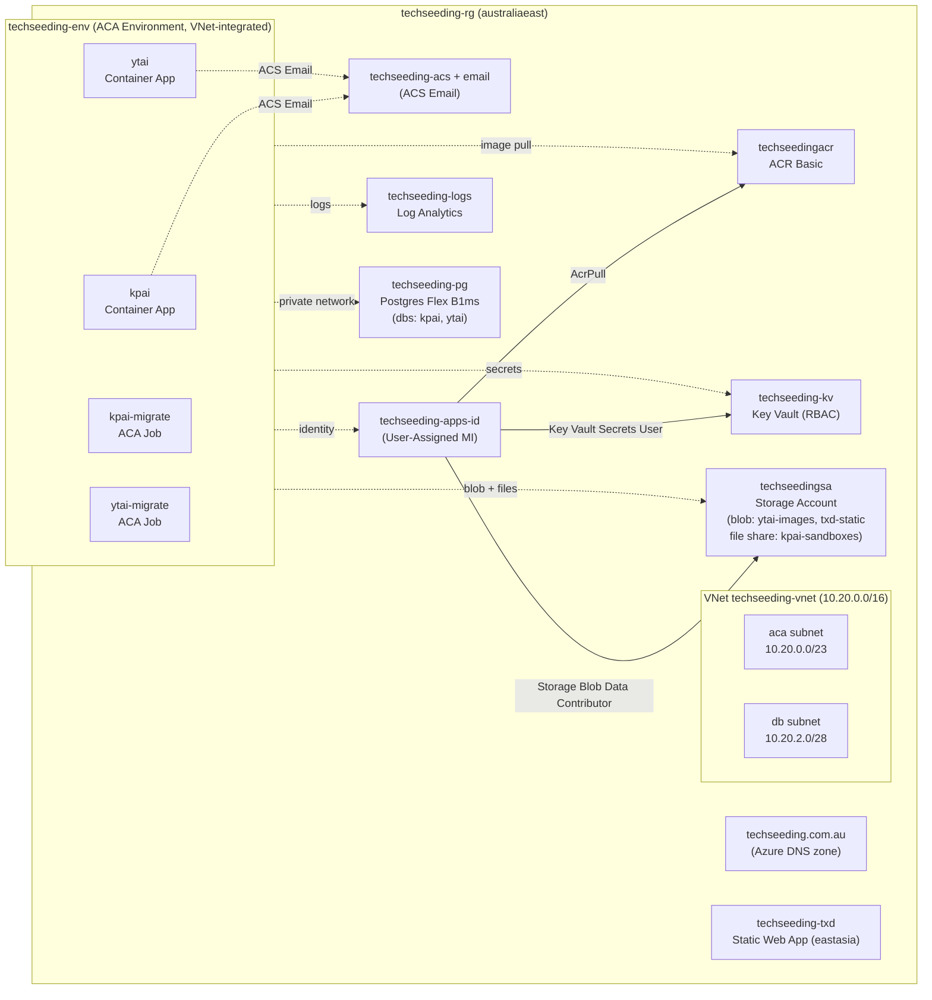

# `@techseeding/deploy-azure`

Bicep + bash for running the techseeding monorepo on Azure: txd as a Static Web App, kpai + ytai as Azure Container Apps backed by a shared Postgres Flexible Server, ACR for images, Key Vault for secrets, and ACS Email for OTP delivery.

## Resource layout

Single resource group, single region (`australiaeast` for everything except the Static Web App which is `eastasia` — SWA's smallest control-plane region near AU).



## Identity model — User-Assigned MI

Every Container App + Job attaches the **same** User-Assigned Managed Identity (`techseeding-apps-id`). That UAMI has its RBAC granted at infra-deploy time:

- `AcrPull` on ACR — so apps can pull their images
- `Key Vault Secrets User` on KV — so ACA secret refs can fetch values
- `Storage Blob Data Contributor` on the storage account — so ytai can read/write blobs via `DefaultAzureCredential`

**Why UAMI, not system-assigned MI per app:** system MI's `principalId` only exists after the app provisions, but the app can't provision its first revision without already having `AcrPull`. Classic chicken-and-egg. UAMI created up front with RBAC pre-assigned breaks the cycle.

## Two-pass deploy

Infra and apps deploy from two separate Bicep templates:

1. **`main.bicep`** (subscription scope, via `pnpm azure:deploy:infra`)
   - Creates the resource group + every infra resource: VNet, Log Analytics, ACR, Postgres, Storage, KV, DNS zone, ACS, ACA Environment, UAMI, Static Web App
   - Does not need container images to exist yet
   - Outputs: ACR login server, Postgres FQDN, KV URI, ACA env id, storage blob endpoint, ACS sender, UAMI id
2. **`apps.bicep`** (resource-group scope, via `pnpm azure:deploy:apps`)
   - Creates the Container Apps + ACA Jobs + their env-var wiring
   - Requires images already in ACR — pass tags via `KPAI_IMAGE_TAG` / `YTAI_IMAGE_TAG`
   - Consumes main's outputs as parameters (`uamiId`, `keyVaultUri`, `postgresFqdn`, etc.)

The script `deploy-apps.sh` auto-discovers main's outputs if you pass `AZURE_DEPLOYMENT_NAME=<name>` of a prior main deploy.

## Secret flow

```
Key Vault (techseeding-kv)
   ↑                                          ┌─ KPAI_JWT_SECRET (env via secretRef)
   │ seed-secrets.sh reads .env.azure-secrets │
   │ and writes:                               │  Container App secret
   │   kpai-jwt-secret                         │    keyVaultUrl=https://kv../secrets/kpai-jwt-secret
   │   kpai-sandbox-deepseek-api-key           ├─→ identity=<UAMI id>
   │   …                                       │
                                               └─ resolved at revision start → injected as env
```

KV holds the raw values. Each Container App declares "Container Apps secrets" that reference the KV URIs and authenticate via the UAMI. Env vars use `secretRef` to expose those secrets to the container at runtime.

DB connection: apps' entrypoints compose `${APP}_DATABASE_URL` from `PG_HOST` (plain env from Bicep) + `PG_PASSWORD` (KV secret ref) + plain `PG_USER`/`PG_PORT`/`PG_DATABASE`. The kpai entrypoint adds `?sslmode=require` because Postgres Flex Server rejects unencrypted connections.

## Network

- **Apps**: external HTTPS ingress on each Container App (Azure-managed FQDN). No ALB equivalent needed.
- **Postgres**: VNet-integrated via the `db` subnet's `Microsoft.DBforPostgreSQL/flexibleServers` delegation + a private DNS zone. **Not reachable from the public internet** — to run psql from a laptop, attach a jumpbox VM in the VNet or use an ACA Job.
- **KV / Storage / ACR**: public endpoints with `defaultAction: Allow` for now; tighten to private endpoints if needed (the `pe` subnet exists for this).

## Release workflow

```bash
pnpm azure:bootstrap         # one-time: az provider register …
pnpm azure:deploy:infra      # main.bicep — RG + every infra resource
pnpm azure:seed-secrets      # .env.azure-secrets → KV
pnpm release:azure:kpai      # build & push image, az containerapp update, run kpai-migrate Job
pnpm release:azure:ytai      # same for ytai
pnpm release:azure:txd       # vite build → swa deploy

# Or to deploy apps without rebuilding images:
pnpm azure:deploy:apps       # apps.bicep — Container Apps + Jobs only
```

`apps.bicep` is parameterized on image tag, custom domain, and the optional model/Google-client overrides — re-running it is the safe way to make a configuration change.

## Operational gotchas (all hit during first bring-up)

- **ACS Email API versions** churn fast. Stick to GA versions (e.g. `2025-09-01`); avoid `*-preview` unless you know it's published.
- **Key Vault purge protection** is tenant-policy-enforced — `enablePurgeProtection: false` is rejected. Once you enable it (which we do), the vault name is reserved for the soft-delete retention window after any deletion.
- **ACS Email custom domain** can be *declared* immediately but **only links** to the ACS resource after DNS verification (DKIM/SPF/DMARC TXT records). `linkCustomDomain` defaults `false`; flip it after the registrar NS update propagates.
- **ACA Consumption profile** requires specific CPU:memory pairings (1:2 ratio). 1.0/4Gi is rejected; use 2.0/4Gi.
- **Static Web Apps** only deploy in 5 regions: centralus, eastus2, westus2, westeurope, eastasia. AU East is not supported. Content is CDN-served globally so the resource region only matters for the control plane.
- **In-place region change for SWA** isn't allowed. To move from westus2 → eastasia we deleted and recreated; the default hostname changes.
- **Postgres Flex Server VNet-mode** can't toggle `publicNetworkAccess: Enabled` after creation. If you need laptop psql access, deploy a jumpbox or use an ACA Job for one-off SQL.

## Files

- `main.bicep` — subscription-scope, RG + everything
- `apps.bicep` — RG-scope, Container Apps + Jobs
- `modules/` — one file per resource type
- `params/prod.bicepparam` — env-driven params (passwords + principal IDs come from `.env.azure-deploy`)
- `scripts/` — orchestration bash: bootstrap, deploy-all, deploy-apps, seed-secrets, build-and-push, migrate, release-{kpai,ytai,txd}, print-ns-records
- `MIGRATION_CHECKLIST.md` — manual steps the operator must do (DNS, secret values, cutover signal, AWS teardown)

See `MIGRATION_CHECKLIST.md` for the manual steps that bookend an automated deploy.
